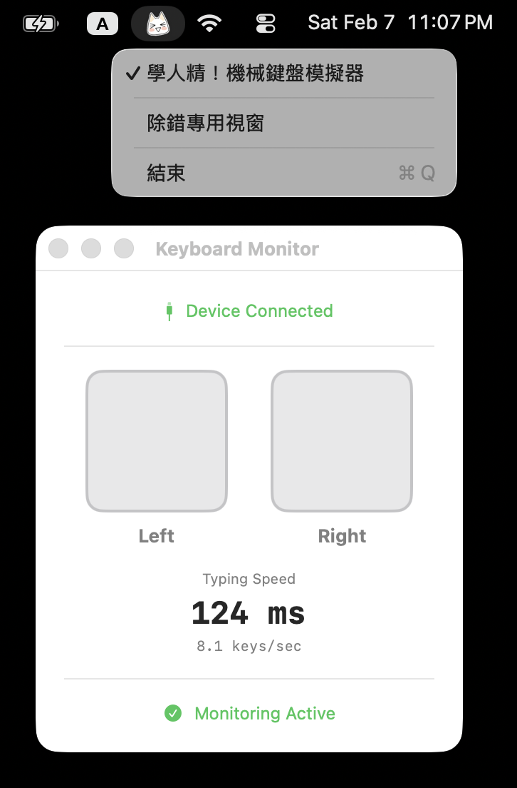

# ToroAlertsMenuExtra

一個 macOS menu bar 應用程式，透過鍵盤打字即時驅動 USB [Hubcot](https://akiba-pc.watch.impress.co.jp/hotline/20010113/etc_toro.html) 裝置揮動手臂。

## 簡介

ToroAlertsMenuExtra 是 [ToroAlerts](https://github.com/digdog/ToroAlerts) 的 menu bar companion app。它在背景監聽鍵盤事件，根據按鍵的左右手位置與打字節奏，自動轉換為對應的裝置動作指令，讓 Toro 或 Kitty 隨著你的打字節奏揮舞雙臂。

### 運作原理

```
鍵盤按鍵 → HID 監聽 → 左右手判定 → 模式識別 → 裝置指令 → Hubcot 揮臂
```

應用程式透過 IOKit HID Manager 捕捉全域鍵盤事件，將每個按鍵映射到鍵盤的左側或右側，再由 `KeyEventMapper` 辨識打字模式（單鍵、連續同側、左右交替），最終透過 [ToroAlerts](https://github.com/digdog/ToroAlerts) 套件裡的 `DeviceCoordinator` 將指令傳送至 USB Hubcot 裝置。

## 功能特點

- **Menu Bar 常駐** — 以 menu bar icon 方式運行，不佔用 Dock 空間
- **一鍵啟停** — 透過 "學人精！機械鍵盤模擬器" 選單項目啟用或停止監聽
- **即時視覺回饋** — 除錯專用視窗顯示連線狀態、左右手指示燈與打字速度
- **智慧模式辨識** — 自動偵測連續同側按鍵、左右交替等打字模式
- **節奏同步** — 裝置揮臂速度隨打字節奏自動調整



## 系統需求

- macOS 15.0 (Sequoia) 或更新版本
- Swift 6.0 或更新版本
- Xcode 26.0 或更新版本（用於建置）
- USB Hubcot 裝置（Toro 或 Kitty）
- 「輸入監視」權限（系統設定 → 隱私權與安全性 → 輸入監視）

## 使用方式

### 啟動

建置並執行應用程式後，menu bar 會出現 Toro 圖示。

### Menu Bar 選單

| 選單項目 | 功能 |
|---------|------|
| **學人精！機械鍵盤模擬器** | 勾選以啟動鍵盤監聽與裝置通訊；取消勾選以停止 |
| **除錯專用視窗** | 開啟監控視窗，顯示即時狀態 |
| **結束** | 結束應用程式（⌘Q） |

### 啟動流程

1. 點擊 menu bar 上的 Toro 圖示
2. 點擊 **學人精！機械鍵盤模擬器** 啟動監聽
3. 圖示會從 ToroOff 切換為 ToroOn，表示已啟動
4. 開始打字，連接的 Hubcot 裝置會跟隨你的打字動作

### 除錯專用視窗

點擊 **除錯專用視窗** 開啟監控視窗，可查看：

- **連線狀態** — 裝置是否已連接，包含錯誤訊息與重新連線按鈕
- **左右指示燈** — 即時顯示目前按下的是左側還是右側按鍵
- **打字速度** — 顯示按鍵間隔（毫秒）與每秒按鍵數

### 鍵盤映射

鍵盤按鍵根據實體位置分為左右兩側：

| 區域 | 按鍵 |
|------|------|
| **左側** | A-G、Q-T、V-Z、1-5、Tab、Esc、CapsLock、F1-F6、左側修飾鍵 |
| **右側** | H-P、U、Y、6-0、標點符號、Return、Backspace、F7-F12、右側修飾鍵、方向鍵、數字鍵盤 |
| **雙側** | Space |

### 模式辨識

`KeyEventMapper` 會辨識以下打字模式：

| 模式 | 觸發條件 | 裝置動作 |
|------|---------|---------|
| 單鍵 | 任意單一按鍵 | 對應側揮臂一次 |
| 右側三連 | 連續 3 次右側按鍵 | `rightTriple` |
| 雙側三連 | 連續 3 次空白鍵 | `bothTriple` |
| 雙側四連 | 連續 4 次空白鍵 | `bothQuad` |
| 左右交替 | L-R-L-R 交替按鍵 | `lrlrlr` / `rlrlrl` |

裝置揮臂的速度會根據打字間隔自動調整，並限制在 50ms～1000ms 之間。

## 專案結構

```
ToroAlertsMenuExtra/
├── ToroAlertsMenuExtra/
│   ├── ToroAlertsMenuExtraApp.swift  # App 入口、MenuBarExtra、bridge 邏輯
│   ├── ContentView.swift             # Keyboard Monitor 視窗 UI
│   ├── KeyboardMonitor.swift         # HID 事件處理與 UI 狀態管理
│   ├── KeyEventMapper.swift          # 按鍵模式辨識與 interval 計算
│   ├── HIDKeyboard.swift             # IOKit HID Manager 鍵盤監聽
│   ├── HIDKeyCode.swift              # USB HID 鍵碼定義與左右側映射
│   └── Assets.xcassets/              # ToroOn/ToroOff menu bar 圖示
└── ToroAlertsMenuExtraTests/
    └── ToroAlertsMenuExtraTests.swift  # 單元測試
```

## 開發

### 建置

在 Xcode 中開啟 `ToroAlertsMenuExtra.xcodeproj` 並建置，或使用快捷鍵 ⌘B。

### 執行測試

在 Xcode 中使用 ⌘U 執行測試，或透過 Product → Test 選單。

測試涵蓋：
- **HIDKeyCodeSideTests** — 鍵碼到左/右/雙側/無的映射（18 個測試）
- **KeyEventMapperTests** — 模式辨識、interval 計算、狀態重置（14 個測試）
- **DeviceRequestExtensionTests** — `isMultiPress` 與 `movementCount`（3 個測試）

### 依賴

- [ToroAlerts](https://github.com/digdog/ToroAlerts) — USB Hubcot 裝置通訊套件
- [AsyncAlgorithms](https://github.com/apple/swift-async-algorithms) — debounce 等非同步演算法

## 授權

本專案採用 **GNU General Public License v2.0 或更新版本** 授權。

```
ToroAlertsMenuExtra - macOS menu bar app for USB Hubcot devices
Copyright (C) 2026 Ching-Lan 'digdog' HUANG

This program is free software; you can redistribute it and/or modify
it under the terms of the GNU General Public License as published by
the Free Software Foundation; either version 2 of the License, or
(at your option) any later version.

This program is distributed in the hope that it will be useful,
but WITHOUT ANY WARRANTY; without even the implied warranty of
MERCHANTABILITY or FITNESS FOR A PARTICULAR PURPOSE.  See the
GNU General Public License for more details.
```

完整授權條款請參閱 [LICENSE](LICENSE) 檔案或訪問 <https://www.gnu.org/licenses/gpl-2.0.html>

### 商標聲明

"Hubcot" 是 Dreams come true co.,Ltd. 的註冊商標。本專案與 Dreams come true co.,Ltd. 無關聯，僅為支援其硬體產品的開源應用程式。

## 相關專案

- [ToroAlerts](https://github.com/digdog/ToroAlerts) — USB Hubcot 裝置驅動程式與命令列工具
- [GNU General Public License](https://www.gnu.org/licenses/gpl-2.0.html)
- [USB-HUBマスコット（トロ）](https://www.sanwa.co.jp/product/syohin?code=A-DTUH-01)
- [Akiba PC Hotline (2001/1/13)): 動くマスコット付きUSB HUBが登場、第1弾は「トロ」](https://akiba-pc.watch.impress.co.jp/hotline/20010113/etc_toro.html)
